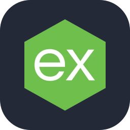

# Abner Delfino Matías Bartolo - NerMat17

**Ingeniero en Sistemas Computacionales · Full Stack Developer · En camino a Cloud & DevOps**

Construyo sistemas web que corren en producción todos los días dentro de la industria automotriz:
APIs, bases de datos, monitoreo en tiempo real e integración con equipos de planta.
Hoy estoy llevando ese trabajo hacia la nube, con AWS, contenedores y CI/CD.

&nbsp;

Querétaro, México

---

## Sobre mí

- Más de 2 años como **Programador Full Stack** en Nihon Plast Mexicana, en un entorno de operación continua.
- Stack principal: **Node.js + SQL Server**, con React en el frontend.
- Me interesa todo el ciclo: levantar requerimientos, diseñar la base de datos, construir la API, desplegar y darle soporte en producción.
- Objetivo: convertirme en un ingeniero full stack con habilidades de **DevOps y Cloud** que diseñe, implemente y despliegue sistemas de punta a punta.

## Proyectos que he liderado

| Proyecto | Qué resolvió |
|---|---|
| **Sistema web de trazabilidad** | Seguimiento de producción en planta, desde el levantamiento de requerimientos hasta su despliegue en producción. |
| **Digitalización de reportes operativos** | Reemplazó reportes en papel con una plataforma web centralizada. |
| **Control de documentos y dibujos técnicos** | Aplicación de escritorio para centralizar y visualizar documentos y dibujos digitales. |

## Lo que hago en el día a día

- APIs REST, lógica de negocio y validaciones con **Node.js / Express**
- Funcionalidades en tiempo real con **WebSockets (Socket.io)**
- Diseño y optimización de bases de datos: consultas, índices y procedimientos almacenados en **SQL Server**
- Integración con dispositivos industriales vía **OPC UA, KepServer y Node-RED**
- Despliegue en **Windows Server (IIS)** y **Linux**, con servicios Node.js en ejecución continua

## Tecnologías

<b>Lenguajes y backend</b>  
  
  
  
  
  &emsp;&emsp;
  
  
  
  

<b>Frontend</b>  
  
  
  
  
  
  

<b>Bases de datos</b>  
  
  
  

<b>Infraestructura y herramientas</b>  
  
  
  
  
  &emsp;&emsp;
  
  
  
  
  

<b>Integración industrial</b>  
  
  
  

<b>Aprendiendo ahora</b>  
  
  
  

## Formación y certificaciones

- **Ingeniería en Sistemas Computacionales** — Instituto Tecnológico Superior de Tamazunchale (2020 – 2024)
- **Meta React Specialization** — Meta, Coursera (sep 2026) · React Basics y Advanced React · [Ver credencial](https://coursera.org/verify/specialization/GMAE7EES6O7S)
- **AWS Fundamentals** — Amazon Web Services, Coursera · *En curso*

## Enfoque actual

- Servicios de **AWS** y fundamentos de cloud, con miras a la certificación **AWS Cloud Practitioner**
- Contenerización con **Docker**
- Pipelines de **CI/CD** y automatización de despliegues
- Arquitecturas escalables y resilientes

## Estadísticas

  
  

 

<picture>
  <source media="(prefers-color-scheme: dark)" srcset="https://raw.githubusercontent.com/NerMat17/NerMat17/output/pacman-contribution-graph-dark.svg">
  <source media="(prefers-color-scheme: light)" srcset="https://raw.githubusercontent.com/NerMat17/NerMat17/output/pacman-contribution-graph.svg">
  
</picture>
